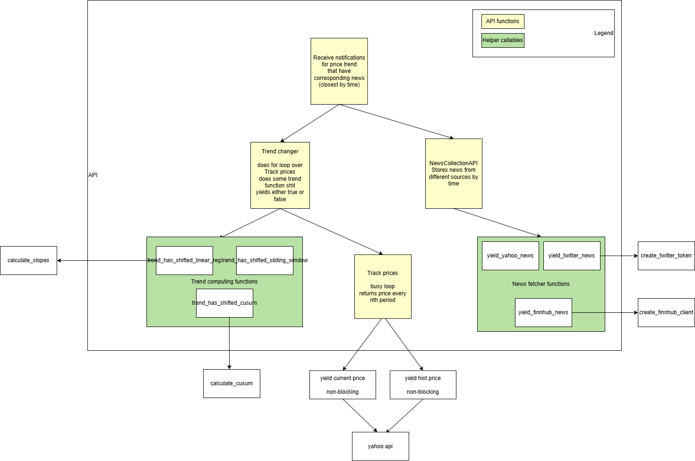

This API provides access to four use cases:
1. Price tracking
2. News tracking
3. Trend shift tracking
4. Trend shift tracking with simultanious news tracking

API diagram looks following

If you'd like to use callable to parse twitts, please set path variable TWITTER_TOKEN 
to your bearer token.